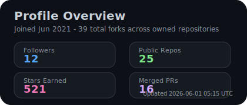
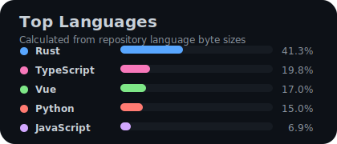
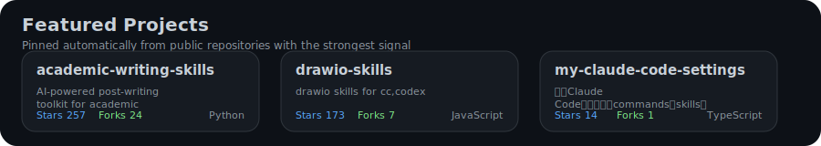

<!-- Profile views -->

  

<!-- Animated Typing Header -->

  

<!-- SEO-friendly description -->

  <strong>bahayonghang</strong> — PhD student researching <em>Industrial Control</em> &amp; <em>Deep Learning</em>. 
  Rust &amp; Python developer, Linux enthusiast, and open-source contributor.

<!-- Social Badges -->

  
  
  
  
  

---

## 🎓 About Me

- 🔬 **PhD Student** specializing in **Industrial Control** & **Deep Learning**
- 🦀 Passionate about **Rust** systems programming
- 🐍 Experienced **Python** developer for ML/DL research
- 🐧 **Linux** enthusiast & open-source contributor

---

## 🛠️ Tech Stack

### Languages

  
  
  

### AI/ML Frameworks

  
  
  

### Tools & Platforms

  
  
  
  

---

## 📚 Research & Publications

🔍 **Research Interests**: Industrial Control · Deep Learning · Rust Systems Programming

📄 **Selected Publications**:

1. **Y. Li** et al., "Predictive Monitoring of Industrial Processes and Quality Indices via Joint Training of Soft Sensor and Time-Series Forecasting," *IEEE Transactions on Industrial Informatics*, 2026. [IEEE Xplore](https://ieeexplore.ieee.org/document/11410600)

2. **Y. Li** et al., "Enhancing Cement Clinker Quality Prediction through Integrated Convolutional and Recurrent Neural Networks with Adversarial Data Augmentation," *Engineering Research Express*, 2025. [ScienceDirect](https://www.sciencedirect.com/science/article/pii/S1568494624005465)

> 📖 Full list available on [Google Scholar](https://scholar.google.com/) · [ORCID](https://orcid.org/0000-0002-6531-636X)

---

## 📊 GitHub Stats

<!-- GitHub Stats Row -->
<table align="center" width="100%">
  <tr>
    <td align="center" width="50%">
      
      
GitHub Overview (generate via GitHub Actions)

    </td>
    <td align="center" width="50%">
      
      
Top Languages (generate via GitHub Actions)

    </td>
  </tr>
</table>

<!-- Streak Stats -->

  
  
GitHub Streak Stats unavailable (service temporarily down)

<!-- Featured Projects -->

  
  
Featured Projects (generate via GitHub Actions)

---

## 🐍 Contribution Snake

<picture>
  <source media="(prefers-color-scheme: dark)" srcset="https://raw.githubusercontent.com/bahayonghang/bahayonghang/output/github-contribution-grid-snake-dark.svg" />
  <source media="(prefers-color-scheme: light)" srcset="https://raw.githubusercontent.com/bahayonghang/bahayonghang/output/github-contribution-grid-snake.svg" />
  
</picture>

---

  

  
<em>⚡ Powered by curiosity and open-source ⚡</em>

